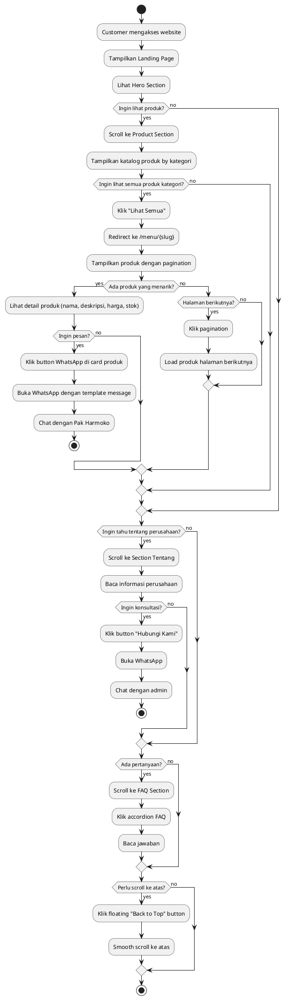
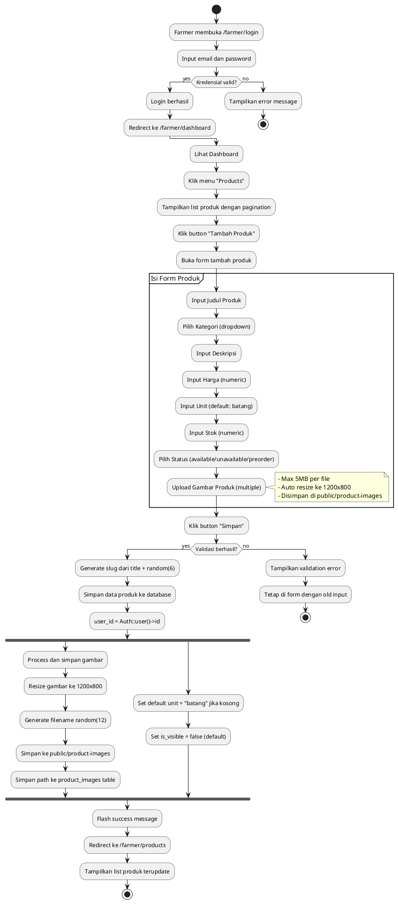
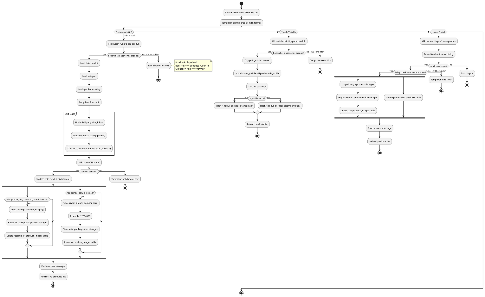
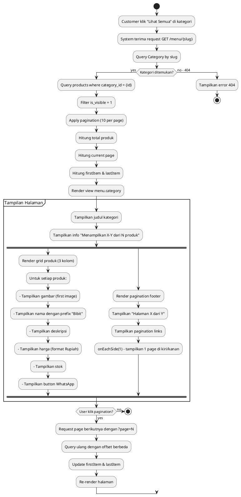

# Activity Diagram - Refloreo Iterum

## 1. Activity Diagram: Browse dan Order Produk (Customer Flow)

## 2. Activity Diagram: Tambah Produk (Farmer Flow)

## 3. Activity Diagram: Edit dan Toggle Visibility Produk (Farmer Flow)

## 4. Activity Diagram: Sistem Pagination Kategori

## Penjelasan Activity Diagram

### 1. Browse dan Order Produk (Customer Flow)
Menggambarkan alur customer dari membuka website, browse produk, filter kategori, hingga melakukan inquiry melalui WhatsApp. Termasuk interaksi dengan FAQ dan back-to-top button.

### 2. Tambah Produk (Farmer Flow)
Menunjukkan proses lengkap farmer menambahkan produk baru, mulai dari login, mengisi form, upload gambar (dengan auto-resize), hingga validasi dan penyimpanan ke database.

### 3. Edit dan Toggle Visibility Produk (Farmer Flow)
Menjelaskan tiga aksi utama farmer: edit produk (termasuk hapus/tambah gambar), toggle visibility untuk hide/show produk, dan hapus produk permanent. Termasuk ProductPolicy authorization check.

### 4. Sistem Pagination Kategori
Menggambarkan mekanisme pagination saat customer membuka halaman kategori penuh, termasuk perhitungan item range, rendering grid produk, dan navigasi antar halaman.

## Key Business Rules dari Activity Diagram

1. **Authorization**: Semua aksi farmer dicek dengan ProductPolicy (owner atau role farmer)
2. **Image Processing**: Auto resize ke 1200x800 saat upload
3. **Visibility**: Produk baru default is_visible = false
4. **Pagination**: 10 produk per halaman dengan onEachSide(1)
5. **WhatsApp Integration**: Template message otomatis dengan nama produk
6. **Slug Generation**: Slug dari title + random 6 karakter untuk uniqueness
