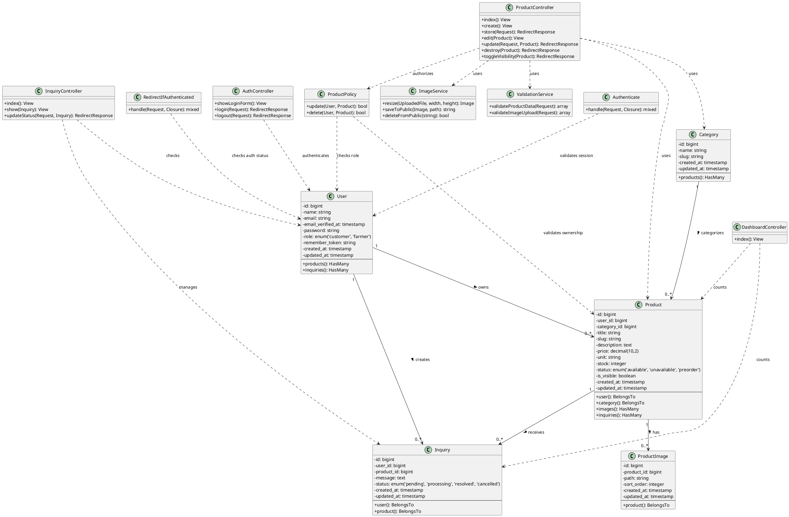

# Class Diagram - Refloreo Iterum

## Diagram



## Detailed Class Descriptions

### Model Classes

#### User
**Purpose**: Represents users in the system (farmers and customers)

**Attributes**:
- `id`: Primary key
- `name`: User's full name
- `email`: Unique email address for authentication
- `password`: Hashed password
- `role`: User role - 'customer' or 'farmer'
- `remember_token`: For "remember me" functionality
- Timestamps: created_at, updated_at

**Relationships**:
- Has many Products (farmers own products)
- Has many Inquiries (customers create inquiries)

**Key Methods**:
- `products()`: Get all products owned by this farmer
- `inquiries()`: Get all inquiries created by this user

---

#### Category
**Purpose**: Product categorization (Kayu, Buah, etc.)

**Attributes**:
- `id`: Primary key
- `name`: Category name (e.g., "Kayu", "Buah")
- `slug`: URL-friendly name (e.g., "kayu", "buah")
- Timestamps: created_at, updated_at

**Relationships**:
- Has many Products

**Key Methods**:
- `products()`: Get all products in this category

**Current Data**:
- Kayu (kayu)
- Buah (buah)

---

#### Product
**Purpose**: Represents a seedling/plant product

**Attributes**:
- `id`: Primary key
- `user_id`: Foreign key to User (farmer who owns this product)
- `category_id`: Foreign key to Category
- `title`: Product name (e.g., "Kayu balsa", "Buah mangga")
- `slug`: Unique URL-friendly identifier (title + random 6 chars)
- `description`: Detailed product description
- `price`: Product price (decimal, 10 digits, 2 decimal places)
- `unit`: Unit of measurement (default: "batang")
- `stock`: Available stock quantity (integer)
- `status`: Availability status - 'available', 'unavailable', or 'preorder'
- `is_visible`: Boolean flag to show/hide product on public catalog
- Timestamps: created_at, updated_at

**Relationships**:
- Belongs to User (farmer)
- Belongs to Category
- Has many ProductImages
- Has many Inquiries

**Key Methods**:
- `user()`: Get the farmer who owns this product
- `category()`: Get the product category
- `images()`: Get all images for this product
- `inquiries()`: Get all inquiries for this product

**Business Rules**:
- Slug must be unique (enforced at creation with random suffix)
- Default is_visible = false (hidden until farmer enables it)
- Default unit = "batang"
- Stock must be >= 0

---

#### ProductImage
**Purpose**: Stores multiple images for each product

**Attributes**:
- `id`: Primary key
- `product_id`: Foreign key to Product
- `path`: Relative path to image file (e.g., "product-images/abc123.jpg")
- `sort_order`: Display order (integer, for future sorting feature)
- Timestamps: created_at, updated_at

**Relationships**:
- Belongs to Product

**Key Methods**:
- `product()`: Get the product this image belongs to

**Storage**:
- Images stored in `public/product-images/`
- Auto-resized to 1200x800 pixels
- Filename: random 12 characters + extension
- Max size: 5MB per image

---

#### Inquiry
**Purpose**: Customer inquiries about products

**Attributes**:
- `id`: Primary key
- `user_id`: Foreign key to User (customer)
- `product_id`: Foreign key to Product
- `message`: Inquiry text
- `status`: Inquiry status - 'pending', 'processing', 'resolved', 'cancelled'
- Timestamps: created_at, updated_at

**Relationships**:
- Belongs to User (customer)
- Belongs to Product

**Key Methods**:
- `user()`: Get the customer who created this inquiry
- `product()`: Get the product being inquired about

---

### Controller Classes

#### AuthController
**Purpose**: Handles authentication for farmers

**Location**: `app/Http/Controllers/Farmer/AuthController.php`

**Methods**:
- `showLoginForm()`: Display login page
- `login(Request)`: Process login credentials, validate, create session
- `logout(Request)`: Destroy session and redirect

**Routes**:
- GET `/farmer/login` → showLoginForm
- POST `/farmer/login` → login
- POST `/farmer/logout` → logout

---

#### DashboardController
**Purpose**: Farmer dashboard overview

**Location**: `app/Http/Controllers/Farmer/DashboardController.php`

**Methods**:
- `index()`: Display dashboard with product count, inquiry count, recent activities

**Routes**:
- GET `/farmer/dashboard` → index

**Authorization**: Requires authentication (auth middleware)

---

#### ProductController
**Purpose**: CRUD operations for products

**Location**: `app/Http/Controllers/Farmer/ProductController.php`

**Methods**:
1. `index()`: List all products owned by authenticated farmer with pagination (10 per page)
2. `create()`: Show product creation form with categories
3. `store(Request)`: 
   - Validate input
   - Create product with user_id = Auth::user()->id
   - Generate unique slug (title + random 6)
   - Process and save uploaded images
   - Redirect with success message
4. `edit(Product)`: 
   - Authorize with ProductPolicy
   - Show edit form with existing data
5. `update(Request, Product)`:
   - Authorize with ProductPolicy
   - Validate input
   - Update product data
   - Handle image removal (remove_images array)
   - Process new image uploads
   - Redirect with success message
6. `destroy(Product)`:
   - Authorize with ProductPolicy
   - Delete all product images from storage
   - Delete product record
   - Redirect with success message
7. `toggleVisibility(Product)`:
   - Authorize with ProductPolicy
   - Toggle is_visible boolean
   - Save and redirect with status message

**Routes**:
- GET `/farmer/products` → index
- GET `/farmer/products/create` → create
- POST `/farmer/products` → store
- GET `/farmer/products/{product}/edit` → edit
- PUT `/farmer/products/{product}` → update
- DELETE `/farmer/products/{product}` → destroy
- POST `/farmer/products/{product}/toggle-visibility` → toggleVisibility

**Authorization**: 
- All routes require authentication (auth middleware)
- edit, update, destroy, toggleVisibility require ProductPolicy check

**Validation Rules**:
```php
[
  'title' => 'required|string|max:255',
  'category_id' => 'required|exists:categories,id',
  'description' => 'required|string',
  'price' => 'required|numeric|min:0',
  'unit' => 'nullable|string|max:50',
  'stock' => 'required|integer|min:0',
  'status' => 'required|in:available,unavailable,preorder',
  'images.*' => 'image|max:5120' // 5MB max per image
]
```

---

#### InquiryController
**Purpose**: Manage customer inquiries

**Location**: `app/Http/Controllers/Farmer/InquiryController.php`

**Methods**:
- `index()`: List all inquiries with pagination
- `show(Inquiry)`: View inquiry details
- `updateStatus(Request, Inquiry)`: Change inquiry status

**Routes**:
- GET `/farmer/inquiries` → index
- GET `/farmer/inquiries/{inquiry}` → show
- POST `/farmer/inquiries/{inquiry}/status` → updateStatus

**Authorization**: Requires authentication

---

### Policy Classes

#### ProductPolicy
**Purpose**: Authorization logic for product operations

**Location**: `app/Policies/ProductPolicy.php`

**Methods**:
1. `update(User $user, Product $product)`: bool
   - Returns true if:
     - user->id === product->user_id (user owns the product), OR
     - user->role === 'farmer' (any farmer can edit)
   - Used before: edit, update, toggleVisibility

2. `delete(User $user, Product $product)`: bool
   - Returns true if:
     - user->id === product->user_id (user owns the product), OR
     - user->role === 'farmer' (any farmer can delete)
   - Used before: destroy

**Registration**: 
Registered in `app/Providers/AuthServiceProvider.php`

**Purpose of Flexible Policy**:
- Fixes 403 errors on production server
- Allows any farmer to manage products (useful for multi-farmer setup)
- Maintains security by still checking farmer role

---

### Middleware Classes

#### Authenticate
**Purpose**: Verify user is logged in

**Location**: `app/Http/Middleware/Authenticate.php`

**Usage**: 
- Applied to all `/farmer/*` routes
- Redirects to login if not authenticated

---

#### RedirectIfAuthenticated
**Purpose**: Prevent logged-in users from accessing login page

**Location**: `app/Http/Middleware/RedirectIfAuthenticated.php`

**Usage**:
- Applied to login routes
- Redirects authenticated users to dashboard

---

### Service Classes

#### ImageService
**Purpose**: Image processing utilities

**Methods**:
- `resize(UploadedFile, width, height)`: Resize image using Intervention Image
- `saveToPublic(Image, path)`: Save processed image to public directory
- `deleteFromPublic(string)`: Delete image file from storage

**Implementation**: 
Currently inline in ProductController, could be extracted to service class

**Image Processing Flow**:
1. Receive uploaded file
2. Generate random filename (12 chars + extension)
3. Move to `public/product-images/`
4. Resize to 1200x800 using Intervention Image
5. Save over original file
6. Store path in database

---

#### ValidationService
**Purpose**: Reusable validation logic

**Methods**:
- `validateProductData(Request)`: Validate product form input
- `validateImageUpload(Request)`: Validate image uploads

**Implementation**:
Currently using inline validation in controllers with `$request->validate()`

---

## Database Schema Relationships

### One-to-Many Relationships

1. **User → Product**
   - One farmer can have many products
   - Foreign key: `products.user_id` → `users.id`
   - Cascade: On user delete, products are deleted

2. **Category → Product**
   - One category can have many products
   - Foreign key: `products.category_id` → `categories.id`
   - Cascade: On category delete, products are deleted

3. **Product → ProductImage**
   - One product can have many images
   - Foreign key: `product_images.product_id` → `products.id`
   - Cascade: On product delete, images are deleted

4. **User → Inquiry**
   - One customer can have many inquiries
   - Foreign key: `inquiries.user_id` → `users.id`
   - Cascade: On user delete, inquiries are deleted

5. **Product → Inquiry**
   - One product can have many inquiries
   - Foreign key: `inquiries.product_id` → `products.id`
   - Cascade: On product delete, inquiries are deleted

---

## Key Design Patterns Used

### 1. MVC Pattern (Model-View-Controller)
- **Models**: Handle data and business logic
- **Views**: Blade templates for presentation
- **Controllers**: Handle HTTP requests and coordinate

### 2. Repository Pattern (via Eloquent ORM)
- Database queries abstracted through Eloquent
- Relationships defined in models
- Query builder for complex queries

### 3. Policy Pattern (Authorization)
- ProductPolicy centralizes authorization logic
- Separates authorization from controller logic
- Reusable across multiple controller methods

### 4. Service Container (Dependency Injection)
- Controllers injected with Request
- Models resolved automatically via route model binding
- Auth facade for user context

### 5. Facade Pattern
- `Auth::user()` - Authentication
- `Storage::delete()` - File operations
- `Image::make()` - Image processing

---

## Current System Constraints

1. **Image Storage**: Local filesystem only (public/product-images)
2. **Authentication**: Session-based only (no API tokens)
3. **Image Limit**: No hard limit on images per product
4. **Pagination**: Fixed at 10 items per page
5. **Search**: No search functionality yet
6. **Cart**: No shopping cart system
7. **Payment**: No payment gateway integration
8. **Roles**: Only 2 roles (customer, farmer) - no admin role
9. **Multi-tenancy**: All farmers see all products in admin
10. **Image Ordering**: sort_order field exists but not implemented in UI

---

## Future Enhancements (Based on Class Structure)

1. **ImageService** class - Extract image processing logic
2. **ValidationService** class - Centralize validation rules
3. **CartService** - Shopping cart functionality
4. **OrderService** - Order management
5. **PaymentService** - Payment gateway integration
6. **SearchService** - Full-text search
7. **NotificationService** - Email/SMS notifications
8. **Admin role** - Separate admin panel for super admin
9. **API Controllers** - REST API for mobile app
10. **Image sorting** - Drag-and-drop image ordering
