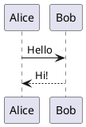

# PlantUML Diagrams - Refloreo Iterum

Folder ini berisi file-file diagram PlantUML (.puml) yang dapat di-preview dan di-export.

## 📁 File Diagram

1. **use-case.puml** - Use Case Diagram dengan 20 use cases
2. **activity-customer-flow.puml** - Activity Diagram: Browse dan Order Produk
3. **activity-add-product.puml** - Activity Diagram: Tambah Produk (Farmer)
4. **class-diagram.puml** - Class Diagram dengan Models, Controllers, Policies

## 🔧 Cara Menggunakan di VS Code

### 1. Preview Diagram
- Buka file `.puml`
- Tekan **`Alt + D`** (atau klik kanan → "Preview Current Diagram")
- Diagram muncul di tab sebelah

### 2. Export ke Gambar
- Klik kanan pada editor
- Pilih **"Export Current Diagram"**
- Pilih format: **PNG** (untuk presentasi), **SVG** (scalable), atau **PDF**
- Pilih lokasi save

### 3. Shortcut Keyboard
- `Alt + D` - Preview diagram
- `Ctrl + Shift + P` → ketik "PlantUML" → pilih aksi

## 🌐 Cara Menggunakan di Web (plantuml.com)

### Method 1: Copy-Paste
1. Buka https://www.plantuml.com/plantuml/uml/
2. Copy seluruh isi file `.puml` (termasuk `@startuml` dan `@enduml`)
3. Paste di text editor sebelah kiri
4. Diagram otomatis muncul di kanan
5. Klik tombol **Download** untuk save PNG/SVG

### Method 2: Upload File
1. Buka https://www.plantuml.com/plantuml/uml/
2. Klik tombol **"Upload"** di atas
3. Pilih file `.puml`
4. Diagram akan di-render
5. Download hasilnya

## 📊 Preview Diagram

### Use Case Diagram
**File**: `use-case.puml`

Menampilkan:
- 2 aktor: Customer/Visitor dan Farmer/Admin
- 9 public features untuk customer
- 11 admin features untuk farmer
- Relasi include dan extend

### Activity Diagrams
**File**: `activity-customer-flow.puml`
- Customer flow: landing → browse → order via WhatsApp

**File**: `activity-add-product.puml`
- Farmer flow: login → tambah produk → upload gambar

### Class Diagram
**File**: `class-diagram.puml`

Menampilkan:
- 5 Models: User, Category, Product, ProductImage, Inquiry
- 2 Controllers: ProductController, AuthController
- 1 Policy: ProductPolicy
- Relationships dan dependencies

## 🎨 Tips Editing

### Warna dan Style
```plantuml
skinparam backgroundColor #FEFEFE
skinparam actorBackgroundColor #90EE90
skinparam usecaseBackgroundColor #87CEEB
```

### Komentar
```plantuml
' Ini adalah komentar (tidak di-render)
```

### Panah
```
--> solid arrow
..> dashed arrow (untuk include/extend)
```

## ❗ Troubleshooting

### Error: "Cannot find Java"
PlantUML butuh Java. Check dengan:
```bash
java -version
```

Install Java jika belum ada:
```bash
sudo apt install default-jre  # Linux
brew install java             # macOS
```

### Extension tidak berfungsi
1. Reload VS Code: `Ctrl + Shift + P` → "Reload Window"
2. Check extension PlantUML sudah terinstall
3. Check settings VS Code: `plantuml.jar` path

### Diagram tidak muncul
- Pastikan ada `@startuml` di awal dan `@enduml` di akhir
- Check syntax error (typo, bracket tidak match)
- Lihat error message di OUTPUT panel VS Code

## 📚 Referensi

- **PlantUML Guide**: https://plantuml.com/guide
- **Use Case**: https://plantuml.com/use-case-diagram
- **Activity**: https://plantuml.com/activity-diagram-beta
- **Class**: https://plantuml.com/class-diagram
- **Online Editor**: https://www.plantuml.com/plantuml/uml/

## 💡 Quick Example

Buat file baru `test.puml`:



Tekan `Alt + D` untuk preview - akan muncul diagram sequence sederhana!
