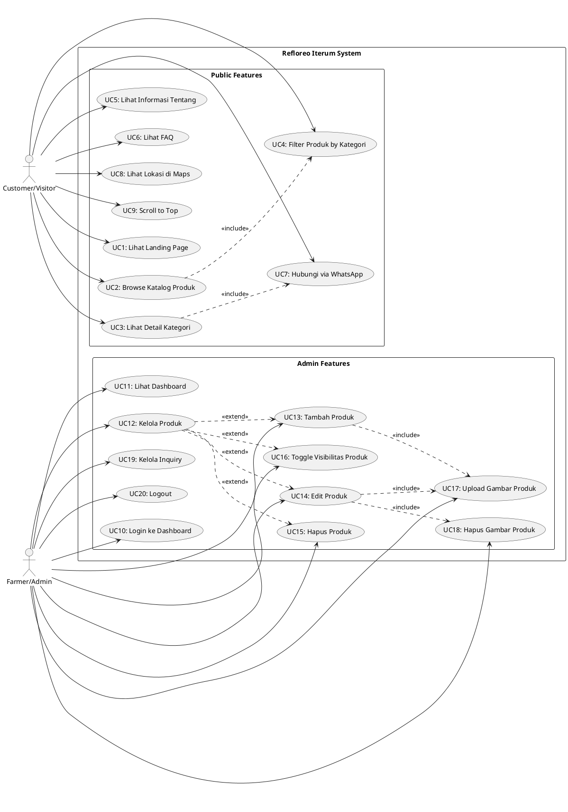

# Use Case Diagram - Refloreo Iterum

## Diagram

## Deskripsi Use Cases

### Public Features (Customer/Visitor)

**UC1: Lihat Landing Page**
- Actor: Customer/Visitor
- Deskripsi: Melihat halaman utama dengan hero section, katalog produk preview, section tentang, FAQ
- Precondition: Mengakses website
- Postcondition: Halaman landing ditampilkan

**UC2: Browse Katalog Produk**
- Actor: Customer/Visitor
- Deskripsi: Melihat katalog produk yang dikelompokkan berdasarkan kategori (Kayu, Buah)
- Precondition: Berada di halaman landing
- Postcondition: Produk ditampilkan dengan informasi nama, harga, stok, deskripsi

**UC3: Lihat Detail Kategori**
- Actor: Customer/Visitor
- Deskripsi: Mengklik "Lihat semua" untuk melihat semua produk dalam kategori tertentu dengan pagination
- Precondition: Katalog produk tersedia
- Postcondition: Halaman kategori dengan pagination 10 produk per halaman ditampilkan

**UC4: Filter Produk by Kategori**
- Actor: Customer/Visitor
- Deskripsi: Produk otomatis difilter berdasarkan kategori yang dipilih
- Precondition: Mengakses halaman kategori
- Postcondition: Hanya produk dari kategori terpilih yang ditampilkan

**UC5: Lihat Informasi Tentang**
- Actor: Customer/Visitor
- Deskripsi: Melihat informasi perusahaan, layanan, dan keunggulan
- Precondition: Scroll ke section tentang
- Postcondition: Informasi perusahaan ditampilkan

**UC6: Lihat FAQ**
- Actor: Customer/Visitor
- Deskripsi: Membaca pertanyaan yang sering diajukan dengan accordion interaktif
- Precondition: Scroll ke section FAQ
- Postcondition: FAQ ditampilkan dan dapat di-toggle

**UC7: Hubungi via WhatsApp**
- Actor: Customer/Visitor
- Deskripsi: Menghubungi admin melalui WhatsApp untuk inquiry produk
- Precondition: Klik button WhatsApp di produk atau section tentang
- Postcondition: WhatsApp terbuka dengan template pesan

**UC8: Lihat Lokasi di Maps**
- Actor: Customer/Visitor
- Deskripsi: Melihat lokasi toko di Google Maps (satelit view)
- Precondition: Scroll ke footer
- Postcondition: Embedded map ditampilkan

**UC9: Scroll to Top**
- Actor: Customer/Visitor
- Deskripsi: Menggunakan floating button untuk kembali ke atas halaman
- Precondition: Scroll lebih dari 300px
- Postcondition: Halaman scroll smooth ke atas

### Admin Features (Farmer/Admin)

**UC10: Login ke Dashboard**
- Actor: Farmer/Admin
- Deskripsi: Login menggunakan email dan password
- Precondition: Memiliki akun farmer
- Postcondition: Redirect ke dashboard farmer

**UC11: Lihat Dashboard**
- Actor: Farmer/Admin
- Deskripsi: Melihat overview produk dan inquiry
- Precondition: Sudah login
- Postcondition: Dashboard ditampilkan

**UC12: Kelola Produk**
- Actor: Farmer/Admin
- Deskripsi: Mengakses halaman manajemen produk dengan list semua produk
- Precondition: Sudah login
- Postcondition: List produk dengan pagination ditampilkan

**UC13: Tambah Produk**
- Actor: Farmer/Admin
- Deskripsi: Menambah produk baru dengan informasi lengkap dan gambar
- Precondition: Berada di halaman tambah produk
- Postcondition: Produk baru tersimpan di database

**UC14: Edit Produk**
- Actor: Farmer/Admin
- Deskripsi: Mengubah informasi produk yang sudah ada
- Precondition: Produk sudah ada, memiliki permission (ProductPolicy)
- Postcondition: Informasi produk terupdate

**UC15: Hapus Produk**
- Actor: Farmer/Admin
- Deskripsi: Menghapus produk beserta gambar-gambarnya
- Precondition: Produk sudah ada, memiliki permission (ProductPolicy)
- Postcondition: Produk dan gambar terhapus dari database dan storage

**UC16: Toggle Visibilitas Produk**
- Actor: Farmer/Admin
- Deskripsi: Menyembunyikan atau menampilkan produk di katalog publik
- Precondition: Produk sudah ada, memiliki permission (ProductPolicy)
- Postcondition: is_visible status berubah

**UC17: Upload Gambar Produk**
- Actor: Farmer/Admin
- Deskripsi: Upload satu atau lebih gambar untuk produk (resize otomatis 1200x800)
- Precondition: Form tambah/edit produk
- Postcondition: Gambar tersimpan di public/product-images

**UC18: Hapus Gambar Produk**
- Actor: Farmer/Admin
- Deskripsi: Menghapus gambar tertentu dari produk saat edit
- Precondition: Edit produk dengan gambar existing
- Postcondition: Gambar terhapus dari storage dan database

**UC19: Kelola Inquiry**
- Actor: Farmer/Admin
- Deskripsi: Melihat dan mengelola inquiry dari customer
- Precondition: Sudah login
- Postcondition: List inquiry ditampilkan

**UC20: Logout**
- Actor: Farmer/Admin
- Deskripsi: Keluar dari dashboard
- Precondition: Sudah login
- Postcondition: Session dihapus, redirect ke halaman login
